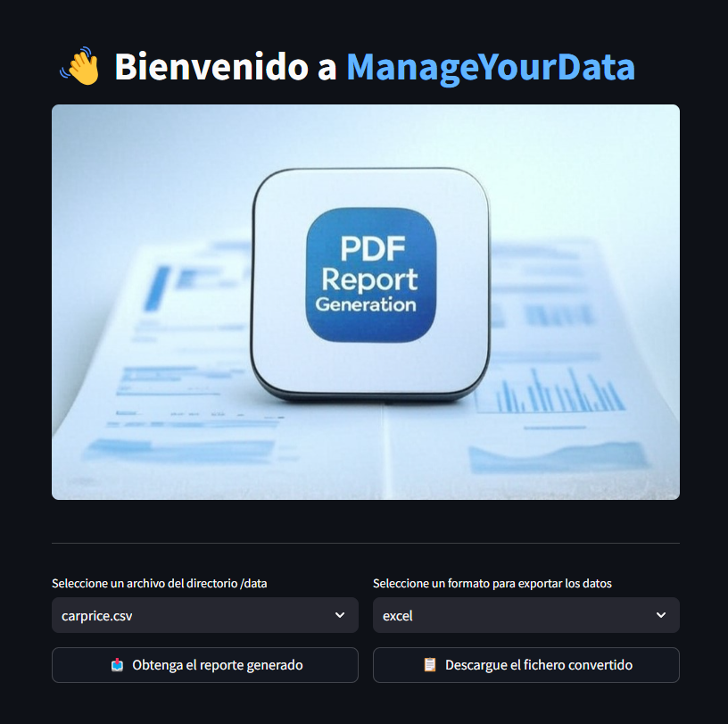

# Generador Automático de Reportes PDF 🚀 [ManageYourData](https://github.com/MarkosHB/ManageYourData)

**ManageYourData** es una herramienta diseñada para analizar datasets de manera automática y generar **reportes detallados en formato PDF** con métricas clave con la finalidad de facilitar la comprensión del mismo. También se permite la conversación con un **asistente de IA** capaz de contestar preguntas sobre el dataset mediante la interfaz gráfica de Streamlit.

Este proceso se realizará **desde el mismo ordenador** en el que se encuentre dicho fichero de datos y por lo tanto no se mandará ninguna información a terceros (exceptuando el uso opcional de la API de Google para la realización del análisis).

---

### 📌 Principales funcionalidades.

✅ **Carga automática de datasets** en formato CSV o EXCEL.

✅ **Generación de reportes en PDF** con estadísticas detalladas.

✅ **Exportación a otros formatos** como CSV o EXCEL.

✅ **Chatbot** inteligente mediante Ollama (local) o Google Gemini (cloud).

✅ **Interfaz gráfica** para facilitar todos los procesos.

✅ **Paquete de Python** como método alternativo mediante terminal.

---

### 🎯 **Modos de ejecución.**
Actualmente existen dos alternativas para poner en funcionamiento **ManageYourData** en su dispositivo:

> [!Note]
> Visite [manageyourdata.streamlit.app](https://manageyourdata.streamlit.app/) para visualizar la herramienta sin necesidad de instalación previa.
> <div align="left">
>    
> </div>

### 0. 🔹 Clonación del repositorio (en ambos casos).
```bash
git clone https://github.com/MarkosHB/ManageYourData
cd ManageYourData
```

### 1. 🔹 Desde la propia terminal de comandos.
> [!Caution]
> Desde este instante usted deberá tener instalado Python>=3.11 si desea seguir con este método.

Opcionalmente, puede crear un entorno virtual para el proceso de instalación.
```bash
python -m venv .venv
```
A continuación, deberá instalar las dependencias de la herramienta...
```bash
pip install -r requirements.txt
```
... y compilar la librería ManageYourData elaborada. 
```bash
pip install .
```
> [!Warning]
> El paquete de Python no ha sido publicado, por lo que debe ser descargado y compilado manualmente.

Finalmente, usted podrá elegir una de las siguientes opciones:
#### A) 🔺Interactuar mediante consola con la herramienta.
```bash
manageyourdata -f data/titanic.csv -r reports/titanic-report.pdf -e excel
```

#### B) 🔺Utilizar la interfaz gráfica para evitar escribir comandos.
```bash
streamlit run frontend.py
```

#### C) 🔺Levantar un servidor que atienda las peticiones con FastAPI.
```bash
fastapi dev api.py
```

### 2. 🔹 Ejecutando el contenedor Docker con la aplicación.
> [!Caution]
> Desde este instante usted deberá tener instalado Docker si desea seguir con este método.

En primer lugar, deberá crear la imagen de la aplicación...
```bash
docker build -t manage_your_data .
```

... para después ejecutar un contenedor incluyéndola.
```bash
docker run --name ManageYourData -p 8501:8501 manage_your_data
```

> [!Tip]
> Aunque sea una posibilidad puesto que se ha elaborado un paquete de Python, es recomendable haber seguido alguno de los métodos anteriores para evitar tener que escribir código al utilizar la herramienta. Usted puede acceder a las funciones de la siguiente manera: 
> ```python
> from manageyourdata.data_manager import DataManager
> 
> dm = DataManager()
> dm.load_data("data/titanic.csv")
> dm.report_pdf("reports/titanic-report.pdf")
> dm.export_data("exports/titanic-exported.xlsx")
> ```

---

### 📂 **Estructura de carpetas de la herramienta.**

```bash
📊 ManageYourData
├── 📁 data/                  # Archivos de datos para analizar.
├── 📁 reports/               # Reportes generados en formato PDF.
├── 📁 exports/               # Ficheros de datos exportados a otros formatos.
├── 📁 images/                # Gráficos elaborados para incluir en el informe.
├── 📁 manageyourdata/        # Código fuente principal (Paquete de Python).
│   ├── 📝 main.py            # Analizador lexicográfico interacción por consola.
│   ├── 📝 data_manager.py    # Módulo con los métodos y funcionalidades.
│   ├── 📝 pdf_generator.py   # Generador de reportes en PDF.
│   ├── 📝 metrics.py         # Productor de información para el reporte.
│   ├── 📝 models.py          # Generador de llms a partir de diferentes proveedores.
│   ├── 📁 utils/             # Archivos de apoyo (estilos, constantes, etc).
├── 📝 frontend.py            # Interfaz gráfica en Streamlit.
└── 📝 Dockerfile             # Contenedorizador de la aplicación.
...
```

> [!Important]
> Se recomienda no modificar la estructura de carpetas para no interferir con el correcto funcionamiento del programa. No obstante, se anima al usuario a colocar y retirar los archivos de datos y generados que allí se encuentran.

---

### 🛠 **Tecnologías Utilizadas.**

- **Python** 🐍 (Lenguaje principal)
- **Pandas** (Análisis de datos)
- **Langchain** (Agentes de IA)
- **FPDF** (Generación de PDFs)
- **Matplotlib** (Visualización de datos)
- **Streamlit** (Interfaz gráfica)

---

### 📄 **Reportes generados con datasets de ejemplo.**

-  [**CarPrice**](https://github.com/MarkosHB/ManageYourData/blob/main/reports/carprice-report.pdf), una colección de aspectos relacionados con el proceso de venta de automóviles. 
-  [**Titanic**](https://github.com/MarkosHB/ManageYourData/blob/main/reports/titanic-report.pdf), con los detalles históricos del famoso transatlántico y su naufragio.

---


### 🤝 **Contribuciones.**

¡Las contribuciones son bienvenidas! Para mejorar el proyecto:

1. **Haga un fork** del repositorio.
2. Cree una **rama nueva** (`git checkout -b feature/nueva-funcionalidad`).
3. Realice los cambios y **haga commit** (`git commit -m "Agregada nueva funcionalidad"`).
4. **Haga un pull request** y se valorarán sus aportes.
